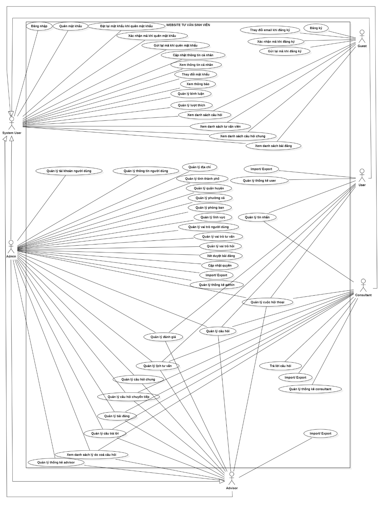
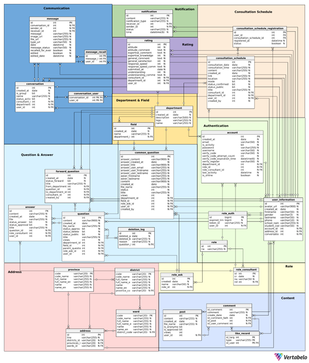

# Tiểu Luận Chuyên Ngành

- Đề tài: **Tìm hiểu Spring Boot, ReactJS và xây dựng website hỗ trợ và tư vấn sinh viên trường ĐHSPKT"**
- Giáo viên hướng dẫn: ThS. Nguyễn Hữu Trung
- Sinh viên:
    - Nguyễn Thái Văn 21110939
    - Ngô Quang Nghĩa 21110559

## Giới thiệu

Website Tư Vấn Sinh Viên là một nền tảng trực tuyến hỗ trợ sinh viên trong việc đặt câu hỏi, thảo luận và nhận tư vấn từ
phía nhà trường về các lĩnh vực học tập, học phí, hoạt động ngoại khóa, nghiên cứu khoa học và nhiều khía cạnh khác của
đời sống sinh viên. Với hệ thống này, sinh viên có thể dễ dàng tiếp cận và trao đổi thông tin, giúp họ nhận được sự hỗ
trợ nhanh chóng và hiệu quả từ ban tư vấn và nhà trường.

## Phân quyền

- **Admin**: Quản lý toàn bộ hệ thống, bao gồm tất cả các phòng ban và thông tin người dùng, có toàn quyền trên mọi tài
  nguyên trong hệ thống.
- **Trưởng ban tư vấn**: Quản lý trong phạm vi phòng ban mà họ phụ trách, bao gồm các tài nguyên và thông tin thuộc
  quyền kiểm soát của phòng ban đó.
- **Tư vấn viên**: Thực hiện các nhiệm vụ liên quan đến phòng ban của họ hoặc các nội dung mà họ được phân công xử lý.
- **User**: Tương tác với các tài nguyên mà họ tạo ra hoặc được cấp quyền truy cập, như các câu hỏi, đánh giá, và lịch
  tư vấn cá nhân,..

## Chức năng hệ thống

| STT | Chức năng                       | Mô tả                                                                                                                                                                                 |
|-----|---------------------------------|---------------------------------------------------------------------------------------------------------------------------------------------------------------------------------------|
| 1   | Đăng nhập                       | Cho phép người dùng chưa xác thực như admin, advisor, consultant, user truy cập vào hệ thống bằng cách cung cấp thông tin tài khoản (email và mật khẩu).                              |
| 2   | Đăng ký                         | Người dùng chưa xác thực như user có thể tạo tài khoản mới bằng cách cung cấp thông tin cá nhân (như email, mật khẩu). Sau khi đăng ký, người dùng cần xác nhận qua mã gửi qua email. |
| 3   | Xác nhận mã khi đăng ký         | Người dùng chưa xác thực như user phải nhập mã xác nhận được gửi đến email để hoàn thành quá trình đăng ký tài khoản.                                                                 |
| 4   | Thay đổi email khi đăng ký      | Người dùng chưa xác thực như user có thể yêu cầu thay đổi địa chỉ email đã cung cấp trong quá trình đăng ký.                                                                          |
| 5   | Gửi lại mã khi đăng ký          | Nếu không nhận được mã xác nhận hoặc mã xác nhận hết hạn, người dùng chưa xác thực có thể yêu cầu hệ thống gửi lại mã xác nhận.                                                       |
| 6   | Quên mật khẩu                   | Người dùng chưa xác thực có thể yêu cầu đặt lại mật khẩu nếu quên bằng cách cung cấp email. Hệ thống sẽ gửi mã xác nhận đến email đã đăng ký.                                         |
| 7   | Xác nhận mã khi quên mật khẩu   | Sau khi yêu cầu đặt lại mật khẩu, người dùng chưa xác thực cần nhập mã xác nhận từ email để tiếp tục quá trình đặt lại mật khẩu.                                                      |
| 8   | Đặt lại mật khẩu                | Sau khi xác nhận mã, người dùng chưa xác thực có thể nhập mật khẩu mới để đặt lại mật khẩu cho tài khoản.                                                                             |
| 9   | Gửi lại mã khi quên mật khẩu    | Nếu người dùng chưa xác thực không nhận được mã xác nhận để đặt lại mật khẩu, họ có thể yêu cầu gửi lại mã.                                                                           |
| 10  | Xem thông báo                   | Người dùng có thể xem các thông báo liên quan đến tài khoản, câu hỏi tư vấn hoặc các thông tin hệ thống khác.                                                                         |
| 11  | Thay đổi mật khẩu               | Người dùng có thể thay đổi mật khẩu của tài khoản từ trang quản lý thông tin cá nhân.                                                                                                 |
| 12  | Cập nhật thông tin cá nhân      | Người dùng có thể thay đổi các thông tin cá nhân khác như tên, ngày sinh, số điện thoại trong hồ sơ cá nhân.                                                                          |
| 13  | Xem thông tin cá nhân           | Người dùng có thể xem lại toàn bộ thông tin cá nhân của mình đã đăng ký với hệ thống.                                                                                                 |
| 14  | Xem danh sách tư vấn viên       | Hệ thống hiển thị danh sách các tư vấn viên hiện có, giúp người dùng như guest, user chọn và liên hệ tư vấn viên phù hợp.                                                             |
| 15  | Xem danh sách câu hỏi chung     | Người dùng như guest, user có thể xem các câu hỏi chung và câu trả lời mẫu từ tư vấn viên.                                                                                            |
| 16  | Xem danh sách câu hỏi           | Hiển thị danh sách các câu hỏi mà người dùng đã tạo hoặc các câu hỏi trong hệ thống mà người dùng như guest, user có quyền xem.                                                       |
| 17  | Xem danh sách bài đăng          | Hiển thị danh sách các bài đăng mà người dùng có thể thấy, từ đó có thể cập nhật được đầy đủ thông tin trong bài đăng.                                                                |
| 18  | Quản lý tài khoản người dùng    | Cho phép admin xem danh sách, thay đổi trạng thái, xem chi tiết tài khoản người dùng.                                                                                                 |
| 19  | Quản lý thông tin người dùng    | Cho phép admin xem danh sách, xem chi tiết thông tin người dùng.                                                                                                                      |
| 20  | Quản lý địa chỉ                 | Cho phép admin xem danh sách, tạo, sửa, xóa, xem chi tiết địa chỉ.                                                                                                                    |
| 21  | Quản lý tỉnh thành phố          | Cho phép admin xem danh sách, tạo, sửa, xóa, xem chi tiết tỉnh thành phố.                                                                                                             |
| 22  | Quản lý quận huyện              | Cho phép admin xem danh sách, tạo, sửa, xóa, xem chi tiết quận huyện.                                                                                                                 |
| 23  | Quản lý phường xã               | Cho phép admin xem danh sách, tạo, sửa, xóa, xem chi tiết phường xã.                                                                                                                  |
| 24  | Quản lý phòng ban               | Cho phép admin xem danh sách, tạo, sửa, xóa, xem chi tiết phòng ban.                                                                                                                  |
| 25  | Quản lý lĩnh vực                | Cho phép admin xem danh sách, tạo, sửa, xóa, xem chi tiết lĩnh vực.                                                                                                                   |
| 26  | Quản lý vai trò người dùng      | Cho phép admin xem danh sách, tạo, sửa, xóa, xem chi tiết vai trò người dùng.                                                                                                         |
| 27  | Quản lý vai trò hỏi             | Cho phép admin xem danh sách, tạo, sửa, xóa, xem chi tiết vai trò hỏi.                                                                                                                |
| 28  | Quản lý vai trò tư vấn          | Cho phép admin xem danh sách, tạo, sửa, xóa, xem chi tiết vai trò tư vấn.                                                                                                             |
| 29  | Xét duyệt bài đăng              | Cho phép admin xét duyệt bài đăng của trưởng ban tư vấn và tư vấn viên.                                                                                                               |
| 30  | Quản lý bài đăng                | Cho phép thực hiện đăng bài, xem danh sách, cập nhật và xóa bài đăng.                                                                                                                 |
| 31  | Xem danh sách lý do xóa câu hỏi | Cho phép admin xem toàn bộ phòng ban và trưởng ban xem các lý do xóa câu hỏi.                                                                                                         |
| 32  | Quản lý câu trả lời             | Cho phép admin quản lý câu trả lời trên toàn bộ phòng ban, trưởng ban xem trong phòng ban của họ.                                                                                     |
| 33  | Quản lý câu hỏi chung           | Cho phép admin và trưởng ban chuyển câu hỏi thành câu hỏi chung, xem danh sách, sửa, xóa, xem chi tiết câu hỏi chung.                                                                 |
| 34  | Quản lý lịch tư vấn             | Quản lý lịch tư vấn cho người dùng, tư vấn viên, trưởng ban và admin theo quyền hạn.                                                                                                  |
| 35  | Quản lý câu hỏi chuyển tiếp     | Cho phép admin quản lý toàn bộ câu hỏi chuyển tiếp và trưởng ban thực hiện theo phòng ban.                                                                                            |
| 36  | Quản lý câu hỏi                 | Cho phép admin quản lý toàn bộ câu hỏi, trưởng ban và tư vấn viên theo phòng ban và người dùng theo câu hỏi của họ.                                                                   |
| 37  | Cập nhật quyền                  | Cho phép admin cập nhật quyền cho người dùng trong hệ thống.                                                                                                                          |
| 38  | Quản lý đánh giá                | Cho phép admin và trưởng ban quản lý đánh giá của người dùng về tư vấn viên.                                                                                                          |
| 39  | Trả lời câu hỏi                 | Tư vấn viên trả lời các câu hỏi liên quan đến phòng ban của họ.                                                                                                                       |
| 40  | Quản lý cuộc hội thoại          | Quản lý cuộc hội thoại giữa tư vấn viên và người dùng theo quyền hạn.                                                                                                                 |
| 41  | Thu hồi tin nhắn phía bản thân  | Cho phép người dùng và tư vấn viên thu hồi tin nhắn từ phía bản thân.                                                                                                                 |
| 42  | Xem lịch sử tin nhắn            | Cho phép người dùng và tư vấn viên xem lịch sử tin nhắn.                                                                                                                              |
| 43  | Nhắn tin riêng tư               | Cho phép người dùng và tư vấn viên gửi tin nhắn riêng tư.                                                                                                                             |
| 44  | Nhắn tin nhóm                   | Cho phép người dùng và tư vấn viên nhắn tin nhóm.                                                                                                                                     |
| 45  | Cập nhật tin nhắn               | Cho phép người dùng và tư vấn viên chỉnh sửa nội dung tin nhắn đã gửi.                                                                                                                |
| 46  | Thu hồi tin nhắn tất cả         | Cho phép người dùng và tư vấn viên thu hồi tất cả tin nhắn đã gửi trong cuộc hội thoại.                                                                                               |
| 47  | Import                          | Cho phép admin và tư vấn viên import dữ liệu từ CSV cho các loại thông tin hệ thống.                                                                                                  |
| 48  | Export                          | Cho phép admin và tư vấn viên export dữ liệu ra CSV hoặc PDF.                                                                                                                         |
| 49  | Thống kê                        | Admin và trưởng ban có thể xem thống kê về hoạt động hệ                                                                                                                               

## Use Case Diagram

## ER Diagram

## Kiến trúc hệ thống

### 1. Tầng Dữ Liệu (Data Layer)

- **MySQL Database**: Sử dụng MySQL làm hệ quản trị cơ sở dữ liệu, với kết nối được quản lý thông qua
  `mysql-connector-java` phiên bản 8.0.33.
- **Spring Data JPA**: Đảm bảo các thao tác CRUD dễ dàng và thuận tiện bằng cách sử dụng các repository với Spring Data
  JPA.

### 2. Tầng Ứng Dụng (Application Layer)

- **Spring Boot**: Dự án sử dụng Spring Boot phiên bản 2.7.17, hỗ trợ tổ chức ứng dụng theo mô hình MVC (
  Model-View-Controller).
- **Các thành phần của tầng ứng dụng**:
    - **Model**: Bao gồm các entity, repository và các service để xử lý nghiệp vụ.
    - **View**: Trả về JSON response hoặc mã trạng thái HTTP, vì ứng dụng là SPA (Single Page Application).
    - **Controller**: Định tuyến các API RESTful, kết nối với frontend qua HTTP và WebSocket để truyền nhận dữ liệu.
- **Dependencies chính**:
    - `spring-boot-starter-web`: Xây dựng API RESTful.
    - `spring-boot-starter-security` và `jjwt`: Cung cấp các tính năng xác thực, phân quyền người dùng.
    - `spring-boot-starter-mail`: Gửi email hỗ trợ cho các tính năng như đăng ký và quên mật khẩu.
    - `spring-boot-starter-websocket`: Kết nối thời gian thực giữa client và server.
    - `mapstruct`: Hỗ trợ chuyển đổi dữ liệu giữa các lớp DTO và Entity.
    - `lombok`: Giúp giảm thiểu mã nguồn bằng các chú thích như `@Getter`, `@Setter`.
    - **Tài liệu và Quản lý Tệp Tin**:
        - Các thư viện `Apache POI`, `pdfbox`, và `itextpdf` được sử dụng để tạo, đọc và xử lý các tệp PDF và Excel.

### 3. Tầng Trình Bày (Presentation Layer)

- **ReactJS**: Giao diện người dùng được phát triển với React, giao tiếp với tầng ứng dụng thông qua các API RESTful và
  WebSocket.
- Ứng dụng ReactJS đảm bảo tính đồng bộ và thời gian thực cho các tính năng cần thiết thông qua các request HTTP và kết
  nối WebSocket.

## Các Tích Hợp Bên Thứ Ba

- **Cloudinary**: Được sử dụng để lưu trữ và quản lý hình ảnh trong hệ thống (`cloudinary-http44` phiên bản 1.36.0).
- **Google API Client**: Sử dụng để gửi email qua Google Mail trong các trường hợp như xác thực người dùng và gửi thông
  báo.

